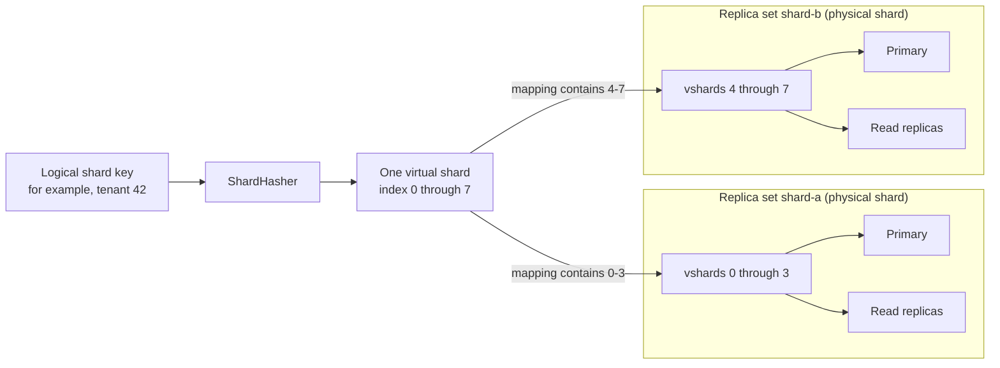

# Topology concepts

This page is a visual guide to the terms used by
[`topology.go`](../topology.go). The main distinction is between **logical
routing** and **physical PostgreSQL endpoints**:

- a shard key is hashed into a virtual shard;
- a virtual shard is mapped to a replica set; and
- the replica set chooses a primary or read replica for the operation.

## Topology at a glance

This example has eight virtual shards placed on two physical shards. A
physical shard is represented in pgmesh by a replica set.



Virtual shards are stable logical buckets, not database servers. Keeping more
virtual shards than physical shards makes it possible to move small groups of
buckets when the physical layout changes. Changing a mapping does not move the
rows; the application must migrate and verify the data before switching it.

## Request-routing flow

The generated routed facade resolves the application value into a shard key.
The runtime mesh starts at `ShardHasher` and selects an endpoint:

```mermaid
flowchart TD
    call["Generated routed query"]
    resolver["Generated route calls<br/>application ShardResolver"]
    key["Logical shard key"]
    hash["ShardHasher.Hash(key)"]
    vshard["Virtual-shard index"]
    mapping["VShardMapping selects<br/>MainReplicaSet"]
    kind{"Operation"}
    read["Next read replica<br/>round-robin; primary if none"]
    primaryRead["Main primary"]
    primaryWrite["Write to main primary"]
    mirrors{"Write mirrors?"}
    mirrorWrites["Write to mirror primaries<br/>sequentially and synchronously"]
    result["Return"]

    call --> resolver --> key --> hash --> vshard --> mapping --> kind
    kind -->|"default read"| read --> result
    kind -->|"strong read"| primaryRead --> result
    kind -->|"write"| primaryWrite --> mirrors
    mirrors -->|"none"| result
    mirrors -->|"configured"| mirrorWrites --> result
```

A default read can observe replication lag. A strong read explicitly uses the
main primary. Mirrors are an application-level migration mechanism: they are
not read replicas, and a mirror failure does not roll back a successful main
primary write.

## Glossary

| Term | Meaning |
| --- | --- |
| Shard key | A stable application value, such as a tenant ID, used for routing. |
| `ShardHasher` | Maps a shard key to one virtual-shard index in `[0, NumVShards)`. |
| Virtual shard | A logical bucket in the mesh routing table. It is not a PostgreSQL endpoint. |
| `Shards` | The configuration containing the virtual-shard count and all placement mappings. Despite the name, it does not contain database connections. |
| `VShardMapping` | Assigns one or more virtual-shard indexes to a main replica set and optional write mirrors. |
| `Connection` | The DSN for one PostgreSQL endpoint. |
| `Node[R, W]` | The read-only and primary-capable generated query views for one connection. |
| `ReplicaSetSpec` | Declarative configuration for one named primary and zero or more read replicas. |
| `ReplicaSet[R, W]` | The runtime representation of one physical shard: one primary plus its read replicas. |
| `MainReplicaSet` | The active replica set that serves reads and primary writes for a mapping. |
| `MirrorReplicaSets` | Replica sets whose primaries receive synchronous copies of writes. They do not serve reads for that mapping. |
| `Mesh` | The validated, immutable table that routes every virtual shard to a runtime replica set. |
| `Shard` | The result of `Mesh.Shard(key)`: the selected replica set plus the virtual-shard index used to reach it. It is not another database. |

Two distinctions prevent most terminology mix-ups:

- A **replica** is one read-only PostgreSQL endpoint. A **replica set** is the
  whole physical shard: its primary and all of its read replicas.
- A **read replica** receives changes through PostgreSQL replication. A **write
  mirror** receives extra writes from the generated pgmesh wrapper, primarily
  during a shard migration.

## Small configuration example

```go
const numVShards = 8

hasher := pgmesh.ModularShardHashFor[uint64](numVShards)

shards := pgmesh.Shards{
    NumVShards: numVShards,
    Mappings: []pgmesh.VShardMapping{
        {
            VShards:        pgmesh.VShardRange(0, 4),
            MainReplicaSet: "shard-a",
        },
        {
            VShards:        pgmesh.VShardRange(4, 8),
            MainReplicaSet: "shard-b",
        },
    },
}
```

With this modular hasher, shard key `42` selects virtual shard `2` because
`42 % 8 == 2`. The first mapping then selects replica set `shard-a`.

## What `CreateMesh` does

`CreateMesh` turns the declarative configuration into the runtime objects used
on every request:

1. Validate replica-set names, connections, mirror references, and complete
   virtual-shard coverage.
2. Call `CreateNode` once for every primary and read-replica connection.
3. Build each runtime `ReplicaSet` and attach mirror writers to main replica
   sets.
4. Link every virtual-shard index to its configured main replica set.
5. Build an immutable `Mesh`, or return the first topology error.

Continue with [Add sharding](how-to/add-sharding.md) for a complete setup or
[Add read replicas](how-to/add-read-replicas.md) for endpoint-selection details.
